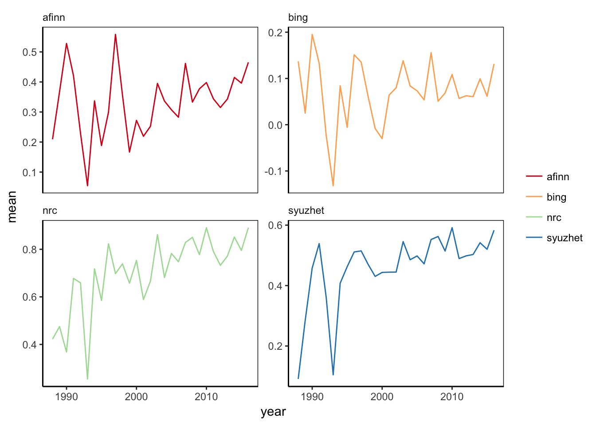
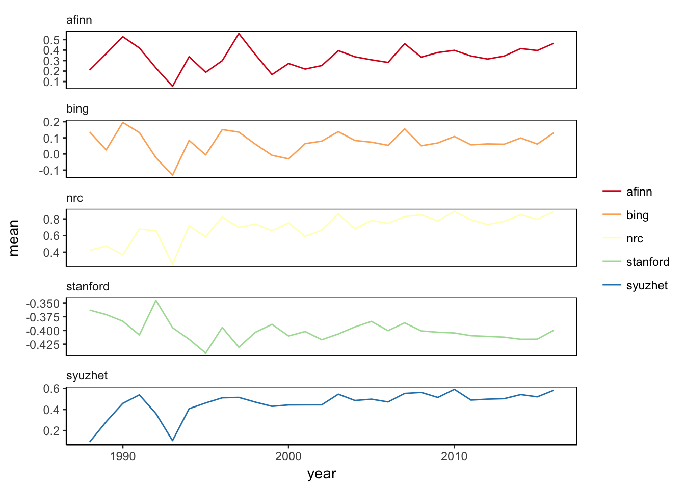
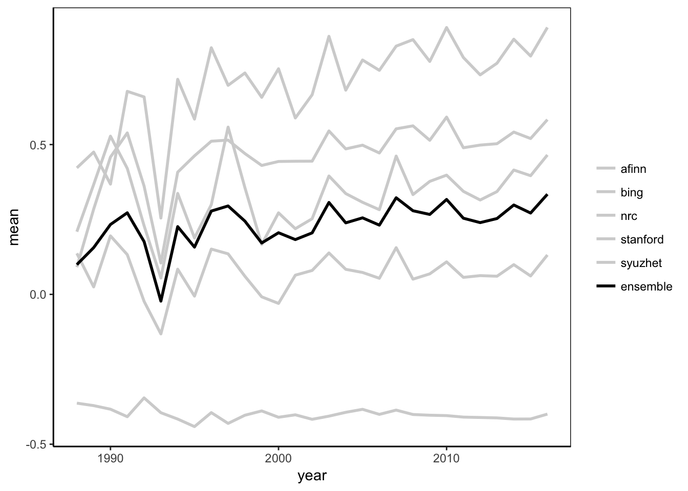
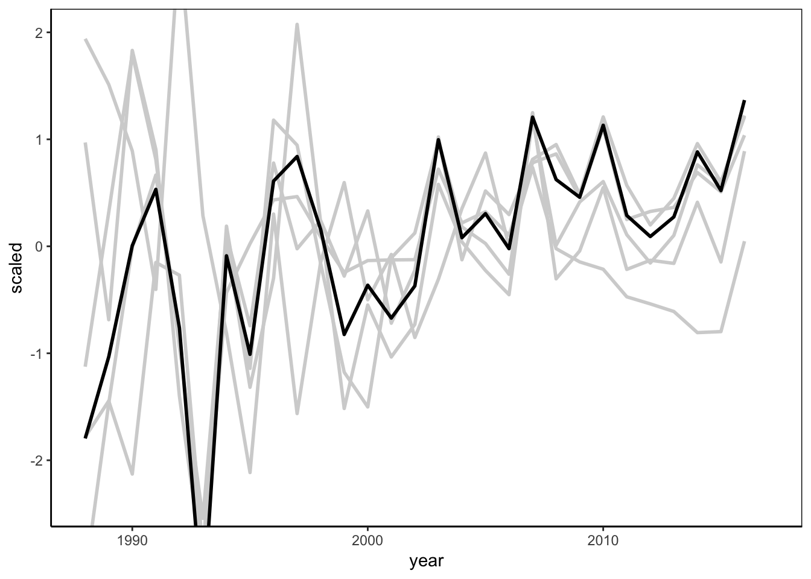
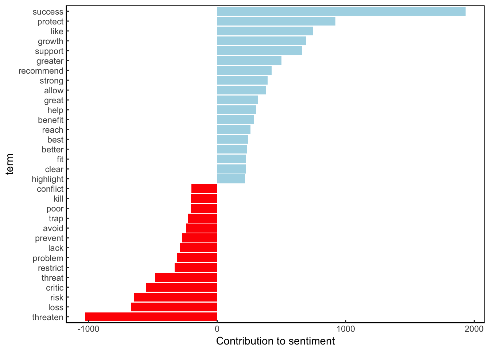
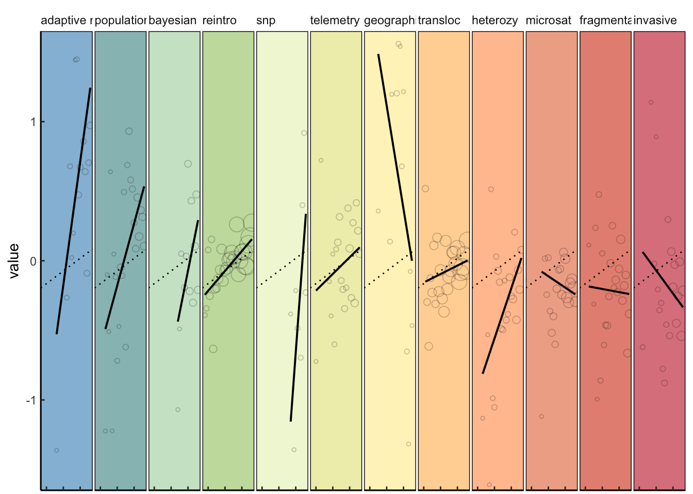
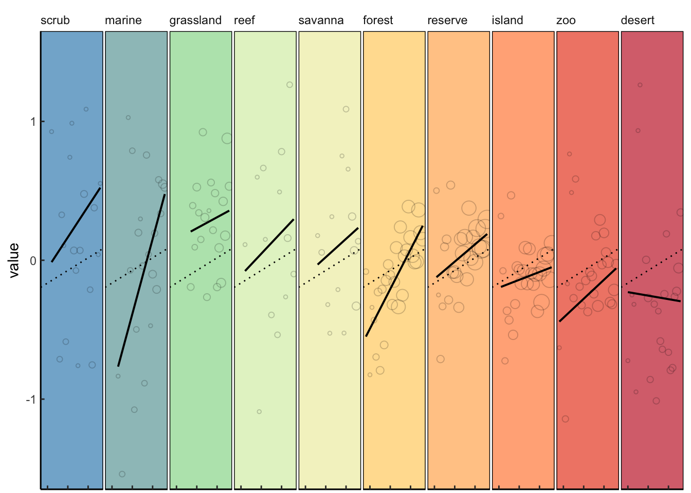
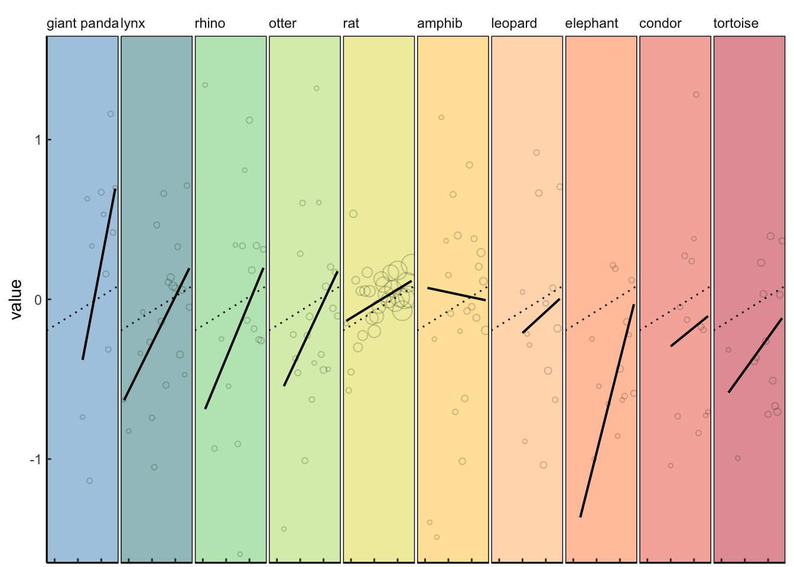

NLP\_tmine\_mdown.R
================
Tyler Gagne
16 August 2017

``` r
# Full species reintroduction sentiment analysis script
library(rJava)
library(xlsx)
```

    ## Loading required package: xlsxjars

``` r
library(ggplot2)
library(textcat)
library(syuzhet)
library(dplyr)
```

    ## Warning: package 'dplyr' was built under R version 3.4.1

    ## 
    ## Attaching package: 'dplyr'

    ## The following objects are masked from 'package:stats':
    ## 
    ##     filter, lag

    ## The following objects are masked from 'package:base':
    ## 
    ##     intersect, setdiff, setequal, union

``` r
library(tm)
```

    ## Loading required package: NLP

    ## 
    ## Attaching package: 'NLP'

    ## The following object is masked from 'package:ggplot2':
    ## 
    ##     annotate

``` r
library(broom)
library(tidytext)
```

    ## Warning: package 'tidytext' was built under R version 3.4.1

``` r
# set working directory
setwd("/Users/tgagne/text mining/data")

############################
##Loading in the abstracts##
############################
#abstracts <- read.csv("abstracts_round2.csv", header = TRUE,stringsAsFactors = FALSE)           #  read in full abstract data csv
#abstracts <- subset(abstracts, YEAR > 1987)
#length(abstracts$ARTICLE)                                                                       #  How many abstracts do we have total?

#########################################
# Removing spanish text from abstracts  #                                                       # Takes about 3-5 minutes for ~4300 abstracts
#########################################
#abstracts$abs_no_esp <- "NULL"

#for( x in 1:length(abstracts$WoS_FIELD )){
#  ab     <- abstracts$WoS_FIELD[x]                                       # subset out single abstract
#  sento  <- syuzhet::get_sentences(ab)                                   # break down by sentences
#  lango  <- textcat( sento,  p = ECIMCI_profiles )                       # generate estimate by sentence of language soruce
#  bound  <- data.frame(cbind(lango,sento))                               # bind sentence to language estimate
#  ingles <- subset(bound, lango == "en")                                 # subset out sentences that are defined as "english"
#  
#  ingles$sento               <- as.character(ingles$sento)               # return sentences to character string
#  no_esp                     <- paste(ingles$sento, collapse = " ")      # bind sentences back in to paragraphed abstract
#  abstracts$abs_no_esp[x]    <- no_esp
#}

#rm(no_esp,sento,x,lango,ab,ingles,bound)                                 # remove unused objects

#save(abstracts, file = "abstracts_rm_Aug16.RData")
load(file = "abstracts_rm_Aug16.RData")

# Fig. 1A. sentiment analysis multi-method ensemble 

##############################################
#  Get sentiment estimates for each method   #                     #  Takes approximately 3 minutes
##############################################
data_box <- NULL
method <- c("syuzhet","bing","afinn","nrc")

for(i in 1:length(method)){

    for(x in 1:length(abstracts$ARTICLE)){
    abstracto <- abstracts$abs_no_esp[x]
    
    s_v <- syuzhet::get_sentences(abstracto)      # break in to individual sentenances
    
    #get the mean of the vector scores
    sentiment <- as.data.frame(mean(get_sentiment(s_v, method = method[i])), col.names = names("sentiment") )
    
    #give the mean its appropriate meta data i.e. ID and year
    colnames(sentiment) <- "sentiment"
    sentiment$year <- abstracts$YEAR[x]
    sentiment$ID <- abstracts$ARTICLE[x]
    sentiment$method <- method[i]
    
    data_box = rbind(data_box,sentiment)  # bind it to the empty data frame
    
  }
}

#sentiment estimates by year x abstract ID x method
str(data_box) 
```

    ## 'data.frame':    17252 obs. of  4 variables:
    ##  $ sentiment: num  -0.55 0.245 0.578 -0.417 0.705 ...
    ##  $ year     : int  1988 1988 1988 1989 1989 1989 1989 1990 1990 1990 ...
    ##  $ ID       : int  99 109 113 122 126 127 133 141 142 144 ...
    ##  $ method   : chr  "syuzhet" "syuzhet" "syuzhet" "syuzhet" ...

``` r
#get yearly standard deviation in sentiment score
yearly_sd <- aggregate(data_box$sentiment, by=list(data_box$year,data_box$method), FUN=sd)
colnames(yearly_sd) <- c("year", "method","sd")

#get yearly mean in sentiment score
yearly_mean <- aggregate(data_box$sentiment, by=list(data_box$year,data_box$method), FUN=mean)
colnames(yearly_mean) <- c("year", "method","mean")

#bind this and generate upper and lower SD bounds
three_meth <- merge(yearly_mean,yearly_sd, by = c("year","method"), all.x = TRUE)
three_meth$upper <- three_meth$mean + three_meth$sd
three_meth$lower <- three_meth$mean - three_meth$sd
```

``` r
#Notce the limited change in SD early on....curious. We initially though the early variability was due to low sample size..huh
ggplot(three_meth,aes(x=year))+
  geom_line(aes(y=mean,color=method))+
  facet_wrap(~method,scale = "free_y",ncol=2)+
  theme_classic()+
  #geom_ribbon(aes(ymin= lower,ymax= upper),alpha = .3)+
  scale_color_brewer(palette = "Spectral") +
  theme(strip.background = element_blank(),
        panel.border = element_rect(colour = "black", fill=NA, size=.5),
        legend.title=element_blank(),
        strip.text=element_text(hjust=0))
```



``` r
##########################################
####      stanford coreNLP attempt     ###    # This is kept seperate as the prior package can't implement coreNLP
##########################################
library(stansent)
```

    ## 
    ## Attaching package: 'stansent'

    ## The following object is masked from 'package:syuzhet':
    ## 
    ##     get_sentences

``` r
data_box_stanford <- NULL

for(x in 1:length(abstracts$ARTICLE)){
  
  abstracto <- abstracts$abs_no_esp[x]
  
  #break in to individual sentenances
  s_v <- syuzhet::get_sentences(abstracto)
  
  #get the mean of the vector scores
  sentiment <- sentiment_stanford(s_v, stanford.tagger = "/Users/tgagne/coreNLP/stanford-corenlp-full-2017-06-09")
  
  sentiment <- mean(sentiment$sentiment)
  sentiment <- as.data.frame(sentiment)
  
  #give the mean its appropriate meta data i.e. ID and year
  colnames(sentiment) <- "sentiment"
  sentiment$year <- abstracts$YEAR[x]
  sentiment$ID <- abstracts$ARTICLE[x]
  sentiment$method <- "stanford"
  
  #bind it to the empty data frame
  data_box_stanford = rbind(data_box_stanford,sentiment) 
  #print(x)
}

save(data_box_stanford, file = "data_box_stanford_Aug16.RData")
load(file = "data_box_stanford_Aug16.RData")

#sentiment estimate x year x abstract ID x method
str(data_box_stanford)
```

    ## 'data.frame':    4313 obs. of  4 variables:
    ##  $ sentiment: num  -0.25 -0.45 -0.389 -0.5 -0.318 ...
    ##  $ year     : int  1988 1988 1988 1989 1989 1989 1989 1990 1990 1990 ...
    ##  $ ID       : int  99 109 113 122 126 127 133 141 142 144 ...
    ##  $ method   : chr  "stanford" "stanford" "stanford" "stanford" ...

``` r
#aggregate and generate SD and mean x year
yearly_sd_stan <- aggregate(data_box_stanford$sentiment, by=list(data_box_stanford$year,data_box_stanford$method), FUN=sd)
colnames(yearly_sd_stan) <- c("year", "method","sd")
yearly_mean_stan <- aggregate(data_box_stanford$sentiment, by=list(data_box_stanford$year,data_box_stanford$method), FUN=mean)
colnames(yearly_mean_stan) <- c("year", "method","mean")
three_meth_stan <- merge(yearly_mean_stan,yearly_sd_stan, by = c("year","method"), all.x = TRUE)
three_meth_stan$upper <- three_meth_stan$mean + three_meth_stan$sd
three_meth_stan$lower <- three_meth_stan$mean - three_meth_stan$sd
full <- rbind(three_meth,three_meth_stan)

str(full)
```

    ## 'data.frame':    145 obs. of  6 variables:
    ##  $ year  : int  1988 1988 1988 1988 1989 1989 1989 1989 1990 1990 ...
    ##  $ method: chr  "afinn" "bing" "nrc" "syuzhet" ...
    ##  $ mean  : num  0.2093 0.137 0.4222 0.0909 0.3667 ...
    ##  $ sd    : num  0.566 0.152 0.367 0.579 0.488 ...
    ##  $ upper : num  0.775 0.289 0.789 0.67 0.854 ...
    ##  $ lower : num  -0.3567 -0.0146 0.0551 -0.4885 -0.121 ...

``` r
#generate plots to show changing sentiment over time.
#remove the hastag infront of geom_ribbon to reveal SD bounded estimates
ggplot(full,aes(x=year))+
  geom_line(aes(y=mean,color=method))+
  facet_wrap(~method,scale = "free_y",ncol=1)+
  theme_classic()+
  #geom_ribbon(aes(ymin= lower,ymax= upper),alpha = .3)+
  scale_color_brewer(palette = "Spectral") +
  theme(strip.background = element_blank(),
        panel.border = element_rect(colour = "black", fill=NA, size=.5),
        legend.title=element_blank(),
        strip.text=element_text(hjust=0))
```



``` r
###########################################################
###   Generate an ensemble mean estimate of sentiment   ###
###########################################################
full_mean <- aggregate(full$mean~full$year, FUN=mean)
full_lower <- aggregate(full$lower~full$year, FUN=mean)
full_upper <- aggregate(full$upper~full$year, FUN=mean)
ensemble <- merge(full_mean, full_lower, by = "full$year")
ensemble <- merge(ensemble, full_upper, by = "full$year")
#ensemble <- cbind(full_mean, full_lower[,2], full_upper[,2])
colnames(ensemble) <- c("year","mean","lower","upper")
ensemble$method <- "ensemble"

a<- full
a$sd <- NULL
str(a)
```

    ## 'data.frame':    145 obs. of  5 variables:
    ##  $ year  : int  1988 1988 1988 1988 1989 1989 1989 1989 1990 1990 ...
    ##  $ method: chr  "afinn" "bing" "nrc" "syuzhet" ...
    ##  $ mean  : num  0.2093 0.137 0.4222 0.0909 0.3667 ...
    ##  $ upper : num  0.775 0.289 0.789 0.67 0.854 ...
    ##  $ lower : num  -0.3567 -0.0146 0.0551 -0.4885 -0.121 ...

``` r
b <- a[,c(1,3,5,4,2)]
str(b)
```

    ## 'data.frame':    145 obs. of  5 variables:
    ##  $ year  : int  1988 1988 1988 1988 1989 1989 1989 1989 1990 1990 ...
    ##  $ mean  : num  0.2093 0.137 0.4222 0.0909 0.3667 ...
    ##  $ lower : num  -0.3567 -0.0146 0.0551 -0.4885 -0.121 ...
    ##  $ upper : num  0.775 0.289 0.789 0.67 0.854 ...
    ##  $ method: chr  "afinn" "bing" "nrc" "syuzhet" ...

``` r
comp <- rbind(b,ensemble)
comp$method <- as.factor(comp$method)
comp$method <- factor(comp$method, levels=c("afinn", "bing", "nrc", "stanford", "syuzhet","ensemble"))

ggplot(comp,aes(x=year))+
  geom_line(aes(y=mean,color = method),size=1)+
  #facet_wrap(~method,scale = "free_y",ncol=2)+
  theme_classic()+
  #geom_ribbon(aes(ymin= lower,ymax= upper),alpha = .3)+
  scale_color_manual(values = c("light gray","light gray","light gray","light gray","light gray","black")) +
  theme(strip.background = element_blank(),
        panel.border = element_rect(colour = "black", fill=NA, size=.5),
        legend.title=element_blank(),
        strip.text=element_text(hjust=0))
```



``` r
########################
##   Scale by group   ##   This is FIG 1. PANEL A
########################
test <- comp %>%
  group_by(method) %>%
  mutate(scaled = scale(mean))

ggplot(test,aes(x=year))+
  geom_line(aes(y=scaled,color = method),size=1,show.legend = F)+
  #facet_wrap(~method,scale = "free_y",ncol=2)+
  theme_classic()+
  #geom_ribbon(aes(ymin= lower,ymax= upper),alpha = .3)+
  scale_color_manual(values = c("light gray","light gray","light gray","light gray","light gray","black")) +
  theme(strip.background = element_blank(),
        panel.border = element_rect(colour = "black", fill=NA, size=.5),
        legend.title=element_blank(),
        strip.text=element_text(hjust=0))+
  coord_cartesian(xlim = c(1988, 2017),ylim = c(-2.4, 2))
```



``` r
###############################################
#                                             #
#  Fig. 1B. and S1. sentiment word frequency  #
#                                             #
###############################################

#############################
##cleaning up and prep work## 
#############################

m<- list(ID = "ARTICLE", content = "abs_no_esp", year = "YEAR")                                  #  set tabular reading criteria for metadata and content
myReader <- readTabular(mapping = m)
mycorpus <- Corpus(DataframeSource(abstracts), readerControl = list(reader = myReader))          #  read in create corpus 

docs <- tm_map(mycorpus, content_transformer(tolower))                                           # Convert the text to lower case
docs <- tm_map(docs, stemDocument)                                                               # Stemming

###########################################
#    Conversion to document term matrix   #
###########################################
dtm <- DocumentTermMatrix(docs)    
ap_td <- tidytext::tidy(dtm)
ap_td
```

    ## # A tibble: 543,328 x 3
    ##    document       term count
    ##       <chr>      <chr> <dbl>
    ##  1        1      adopt     1
    ##  2        1        and     3
    ##  3        1       anim     3
    ##  4        1     aspect     1
    ##  5        1       bred     1
    ##  6        1     captiv     1
    ##  7        1   criteria     1
    ##  8        1    current     1
    ##  9        1 discussed.     1
    ## 10        1  distribut     1
    ## # ... with 543,318 more rows

``` r
ap_sentiments <- ap_td %>%
  inner_join(get_sentiments("afinn"), by = c(term = "word"))
ap_sentiments$sentiment <- ifelse(ap_sentiments$score > 0, "positive","negative")
ap_sentiments
```

    ## # A tibble: 16,574 x 5
    ##    document      term count score sentiment
    ##       <chr>     <chr> <dbl> <int>     <chr>
    ##  1        1     adopt     1     1  positive
    ##  2        2     crash     1    -2  negative
    ##  3        2   protect     1     1  positive
    ##  4        2    strong     2     2  positive
    ##  5        2   success     3     2  positive
    ##  6        3 disappear     1    -1  negative
    ##  7        3      loss     1    -3  negative
    ##  8        3   protect     1     1  positive
    ##  9        3  restrict     1    -2  negative
    ## 10        4       bad     1    -3  negative
    ## # ... with 16,564 more rows

``` r
##############################
#   This is FIG. 1 Panel B   #
##############################
#ggplot theme#
a<-theme_classic()+
  theme(strip.background = element_blank(),
        axis.text.x = element_text(margin = margin( 0.2, unit = "cm")),
        axis.text.y = element_text(margin = margin(c(1, 0.2), unit = "cm")),
        axis.ticks.length=unit(-0.1, "cm"),
        panel.border = element_rect(colour = "black", fill=NA, size=.5),
        legend.title=element_blank(),
        legend.position = c(0.8, .85),
        strip.text=element_text(hjust=0))

ap_sentiments %>%
  count(sentiment, term, wt = count) %>%
  ungroup() %>%
  filter(n >= 200) %>%
  mutate(n = ifelse(sentiment == "negative", -n, n)) %>%
  mutate(term = reorder(term, n)) %>%
  ggplot(aes(term, n, fill = sentiment)) +
  geom_bar(stat = "identity",show.legend = F) +
  theme(axis.text.x = element_text(angle = 90, hjust = 1)) +
  ylab("Contribution to sentiment") +
  coord_flip()+
  scale_fill_manual(values = (c("red","lightblue")))+a
```



``` r
##########################
# Wordcloud just because #
##########################
library(wordcloud)
```

    ## Loading required package: RColorBrewer

``` r
library(reshape2)

ap_td %>%
  inner_join(get_sentiments("afinn"), by = c(term = "word")) %>%
  mutate(sentiment = ifelse(score < 0, "negative","positive") ) %>%
  count(term, sentiment, sort = TRUE) %>%
  acast(term ~ sentiment, value.var = "n", fill = 0) %>%
  comparison.cloud(colors = c("#d73027", "#74add1"),
                   max.words = 100)
```


``` r
#################################################################
#                                                               #
# Fig. 2A-C. Longitudinal history of associative word sentiment #
#                                                               #
#################################################################

#dataframe molding and cleaning
abstracts$ID <- NULL
abstracts$X <- NULL
abstracts$WoS_FIELD <- NULL
colnames(abstracts) <- c("ID","WoS_CODE","year","abstract")
abstracts$abstract <- tolower(abstracts$abstract)                         # convert all characters to lower case

# knead sentiment data from sentiment array script 
cast <- dcast(data = data_box, formula = ID*year ~ method, value.var = "sentiment")   
data_box_stanford$method <- NULL
colnames(data_box_stanford) <- c("stanford","year","ID")
test<- merge(abstracts,cast, by = c("year","ID"))
bind<- merge(test, data_box_stanford,by = c("year","ID"))

#sum count of abstracts by year...
bind <- bind %>%
  group_by(year) %>%
  mutate(yearly_count = n())

bind[,5:9]<-scale(bind[,5:9])
bind$mean_sent <-  as.vector(scale(( bind$afinn + bind$bing + bind$nrc + bind$syuzhet + bind$stanford ) / 5))   # generate mean ensemble sentiment by multiple methods
bind <- data.frame(bind)
str(bind)
```

    ## 'data.frame':    4313 obs. of  11 variables:
    ##  $ year        : int  1988 1988 1988 1989 1989 1989 1989 1990 1990 1990 ...
    ##  $ ID          : int  109 113 99 122 126 127 133 141 142 144 ...
    ##  $ WoS_CODE    : chr  "AB" "AB" "AB" "AB" ...
    ##  $ abstract    : chr  "after a sharp decline in numbers during the early decades of the 20th century, the last raven was found breedin"| __truncated__ "lathyrus pisiformis was recently found at 14 localities in poland (known from 21 localities altogether). 9 of t"| __truncated__ "in the framework of a project to reintroduce the european lynx, the criteria for the reintroduction of locally "| __truncated__ "by help of questionnaires sent to the respective organisations maps on the present distribution of roe deer, fo"| __truncated__ ...
    ##  $ afinn       : num  0.631 -0.738 -0.454 -0.88 0.567 ...
    ##  $ bing        : num  0.4455 0.068 -0.154 -0.8202 0.0458 ...
    ##  $ nrc         : num  -0.229 -0.145 -0.985 -1.826 -0.481 ...
    ##  $ syuzhet     : num  -0.507 0.125 -2.016 -1.763 0.367 ...
    ##  $ stanford    : num  -0.384 0.142 1.337 -0.814 0.751 ...
    ##  $ yearly_count: int  3 3 3 4 4 4 4 6 6 6 ...
    ##  $ mean_sent   : num  -0.0118 -0.1516 -0.6299 -1.6916 0.3463 ...

``` r
##################################################
####    Ordered by 2013-2015 intercept plot   ####
##################################################

# Do one by one iterative (could build loop later)
#Methods     
methods_words <- c("snp","population viability","adaptive m","invasive","transloc","microsat","heterozy","bayesian","reintro","fragmentat","telemetry", "geographic info" )
#Locations
location_words <- c("marine","desert","scrub","forest","grassland","savanna","island","reserve","zoo","reef")
#Species
spp_words <- c("elephant","condor","rhino","rat","tortoise","leopard","lynx","amphib","otter","giant panda")

words_thru_time <- function(wordlist){

uhaul <- NULL

for(x in 1:length(wordlist)){
  
  df <- bind[ grep( wordlist[x], bind$abstract), ]                               # pull out abstracts contain word[x]
  df <- df %>% group_by(year) %>% mutate(j_ww_count = n())                       # pull out journal count with word
  df <- df %>%            
    group_by(year) %>%
    dplyr::select(mean_sent,j_ww_count) %>%                                      # getting error in select, never had one before? fix: MASS package masks dplyr select() 
    summarise(j_ww_count = mean(j_ww_count), word = mean(mean_sent))
  
  colnames(df) <- c("year","num_o_abs",wordlist[x])
  df           <- melt(df, id.vars = c("year","num_o_abs"))
  mod          <- lm(value ~ year, data = df)                                    # lm of sentiment x time for abstracts containg word[x]
  df$lm_mod    <- predict(mod)                                                   # predict lm output  
  a_5yr        <- data.frame(c(2013,2014,2015,2016))
  colnames(a_5yr) <- c("year")
  df$final_val <- mean(predict(mod, newdata = a_5yr))                            # estimate 2013-2016 absolute mean sentiment
  df$beta_coef <- data.frame(mod$coefficients)[2,]                               # column of beta coef for lm specific to word[x]
  uhaul <- rbind(df,uhaul)
}

global_lm <- bind %>% group_by(year) %>% summarise(sentiment = mean(mean_sent))
global_lm <- lm(sentiment ~ year, data = global_lm)
slope <- data.frame(global_lm $coefficients)[2,]
intercept <- data.frame(global_lm $coefficients)[1,]
uhaul$variable<-factor(uhaul$variable, levels = unique(uhaul$variable[order(-uhaul$final_val)]), ordered=TRUE)
uhaul$final_val_rank <- as.integer(uhaul$variable)

plotted_words <- ggplot(uhaul,aes(year,value))+
  geom_rect(aes(xmin = -Inf,xmax = Inf, ymin = -Inf, ymax = Inf, fill = final_val_rank),alpha = .05, show.legend = F)+
  geom_point(aes(size = num_o_abs), color = "black", pch = 1, show.legend = F, alpha = .2)+
  geom_abline(intercept = intercept, slope = slope, lty = 3, size = .5)+
  #geom_text(aes(label = variable), hjust = 0,x= 1989, y = 1.4, family = "Calibri",size = 3)+
  facet_wrap(~variable, nrow = 1)+
  geom_smooth(method = "lm", se = F, color = "black", size = .7)+
  scale_fill_distiller(palette = "Spectral",direction=-1)+
  coord_cartesian(ylim=c(-1.5,1.5))+
  
  a+theme(
    #strip.text = element_blank(),
    panel.spacing = unit(0.1,"lines"),
    #axis.text.x = element_text(angle = 90, hjust = 1),
    axis.text.x = element_blank())+
  xlab(NULL)
return(plotted_words)
print("plot is ready and saved as 'plot'")
}

#word selection 1
words_thru_time(methods_words)
```

    ## Adding missing grouping variables: `year`

    ## Adding missing grouping variables: `year`
    ## Adding missing grouping variables: `year`
    ## Adding missing grouping variables: `year`
    ## Adding missing grouping variables: `year`
    ## Adding missing grouping variables: `year`
    ## Adding missing grouping variables: `year`
    ## Adding missing grouping variables: `year`
    ## Adding missing grouping variables: `year`
    ## Adding missing grouping variables: `year`
    ## Adding missing grouping variables: `year`
    ## Adding missing grouping variables: `year`



``` r
#word selection 2
words_thru_time(location_words)
```

    ## Adding missing grouping variables: `year`
    ## Adding missing grouping variables: `year`
    ## Adding missing grouping variables: `year`
    ## Adding missing grouping variables: `year`
    ## Adding missing grouping variables: `year`
    ## Adding missing grouping variables: `year`
    ## Adding missing grouping variables: `year`
    ## Adding missing grouping variables: `year`
    ## Adding missing grouping variables: `year`
    ## Adding missing grouping variables: `year`



``` r
#word selection 3
words_thru_time(spp_words)
```

    ## Adding missing grouping variables: `year`
    ## Adding missing grouping variables: `year`
    ## Adding missing grouping variables: `year`
    ## Adding missing grouping variables: `year`
    ## Adding missing grouping variables: `year`
    ## Adding missing grouping variables: `year`
    ## Adding missing grouping variables: `year`
    ## Adding missing grouping variables: `year`
    ## Adding missing grouping variables: `year`
    ## Adding missing grouping variables: `year`



``` r
#
```
